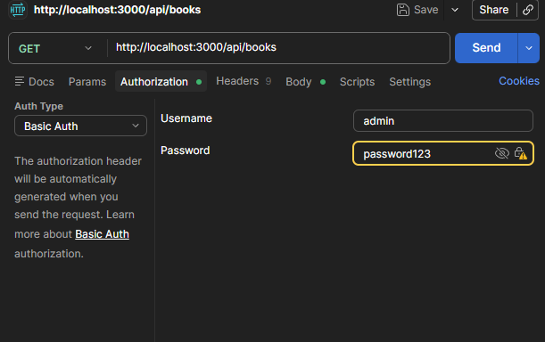
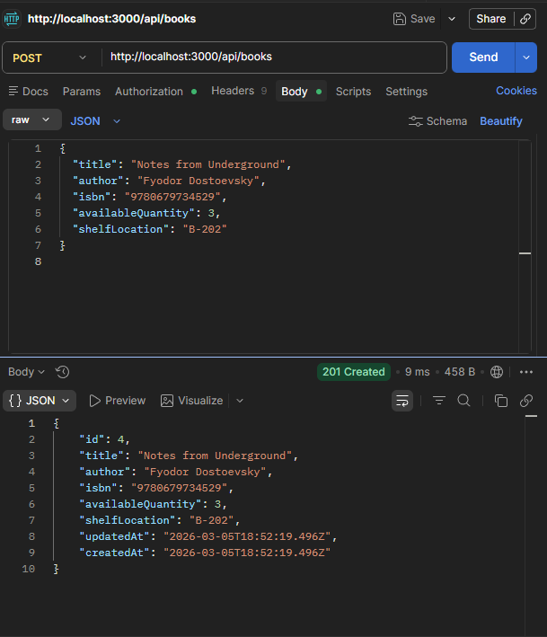
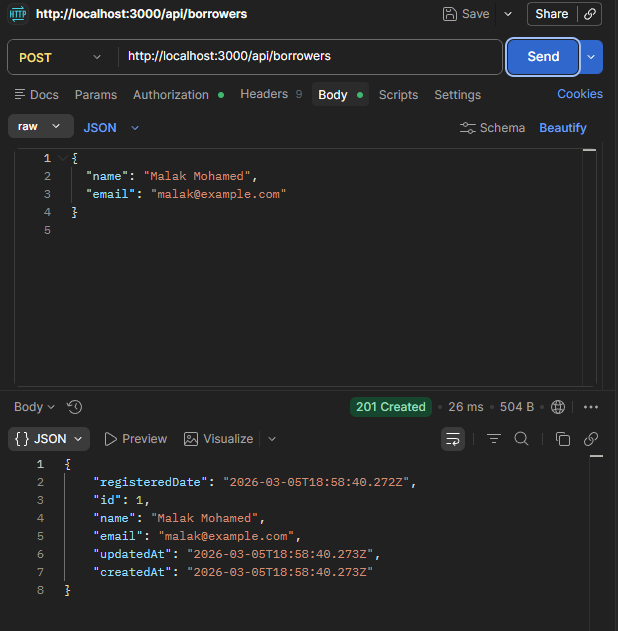
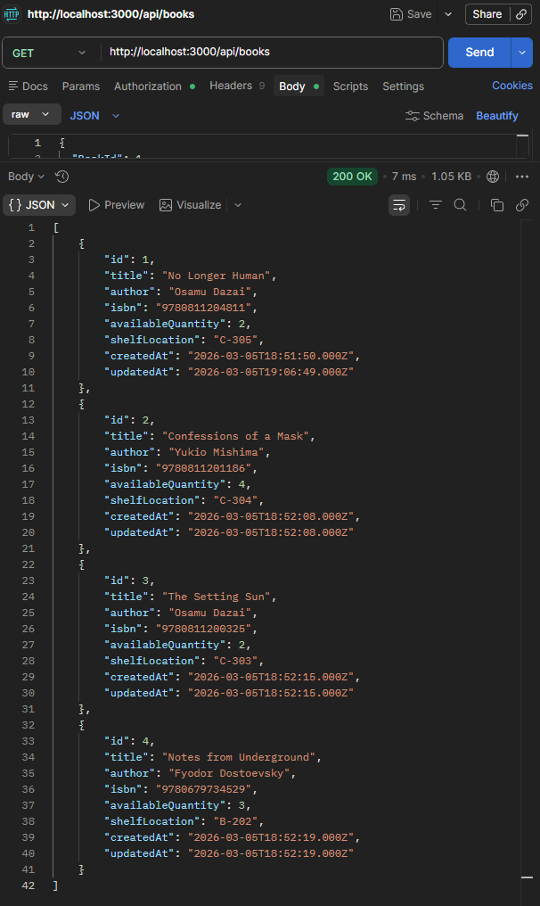
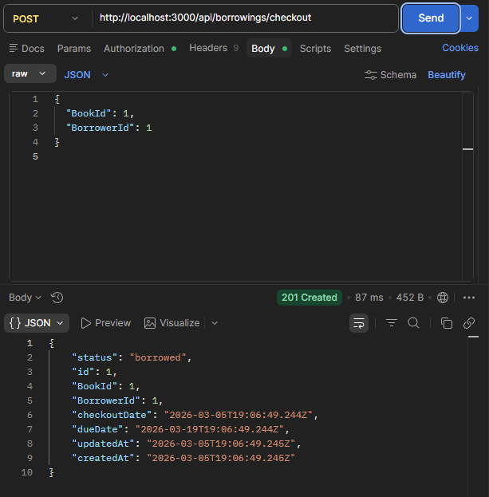
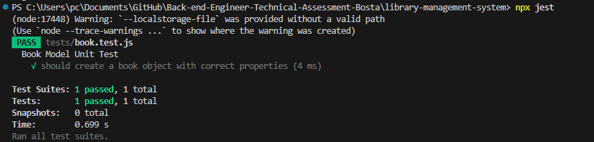

# 📚 Library Management System API
A professional RESTful API built with **Node.js**, **Express**, and **MySQL** (Sequelize) to manage library operations. 
---

## 🎯 Project Purpose
This project was developed specifically as a **Technical Assessment** for the **Back-end Engineer (Fresher)** position at **Bosta**. The goal was to demonstrate proficiency in building a scalable, secure, and performant relational database system while adhering to modern RESTful principles.

## 🚀 Features & Implementation
* **Inventory Management**: Full CRUD for books with indexed search (Title/Author/ISBN).
* **Borrower Management**: Registration with unique constraint validation.
* **Transaction Logic**: Automated stock management (Quantity -1 on checkout, +1 on return).
* **Security**: **Basic Authentication** and **Rate Limiting** to prevent API abuse.
* **Performance**: Normalized schema with optimized database indexing.
* **Reporting**: Advanced CSV exports for all transactions and overdue tracking.
* **Testing**: Automated Unit Testing suite for data integrity.

---

## 📸 System Showcase

| Feature | Visual Confirmation |
| :--- | :--- |
| **Auth Check** |  |
| **Book Creation** |  |
| **Borrower Creation** |  |
| **Stock Logic** |  |
| **Borrowing Process** |  |
| **Unit Testing** |  |

---

## 🛠️ Setup & Installation1. **Clone & Enter Directory**:

   git clone <your-repo-url>
   cd library-management-system

   1. Install Dependencies:
   
   npm install
   
   2. Database Configuration:
   * Create a MySQL database named library_db.
      * Update config/db.js with your local MySQL user and password.
      * Tables generate automatically via Sequelize Sync on startup.
   3. Execution:
   
   npm start # Run Server
   npm test  # Run Unit Tests
   
   
------------------------------
🔑 API Documentation & Auth
Credentials: admin / password123

| Method | Endpoint | Description |
|---|---|---|
| GET | /api/books/search?q=... | Search books (Title/Author/ISBN) |
| POST | /api/books | Add new book to inventory |
| POST | /api/borrowings/checkout | Process a book checkout |
| POST | /api/borrowings/return/:id | Process a return & update stock |
| GET | /api/borrowings/export/all | Export analytical CSV report |

------------------------------
🧪 Error Handling & Edge Cases
The system includes a centralized error-handling middleware to catch:

* 400 Bad Request: Prevents duplicate ISBNs or invalid emails.
* 401 Unauthorized: Blocks requests without valid Basic Auth headers.
* 429 Too Many Requests: Throttles users hitting search/register too fast.
* 500 Internal Error: Provides sanitized feedback for server-side exceptions.

------------------------------
👤 Contributor

* Malak Mohamed
* Role: Back-end Engineer Applicant
* [GitHub Profile](https://github.com/MalakMohameed)

------------------------------
⚠️ Disclaimer
This software is provided as a technical assessment for Bosta. It is intended for evaluation purposes and is not designed for a production environment without further security hardening (e.g., JWT implementation, production-grade logging).

